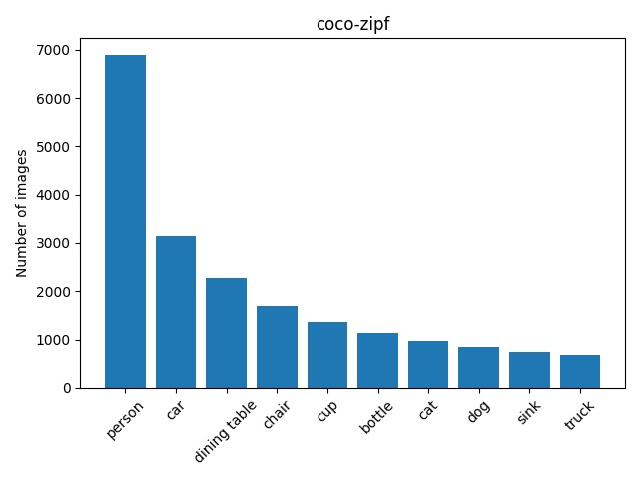
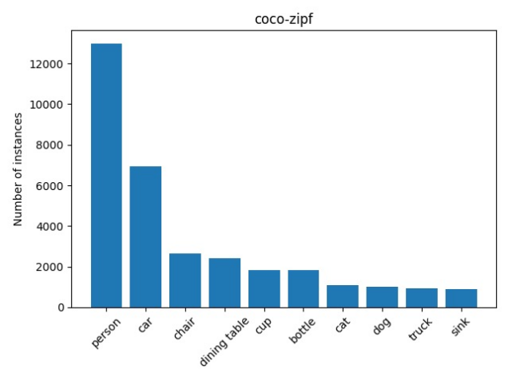
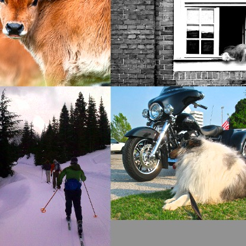
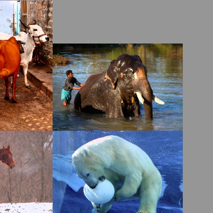
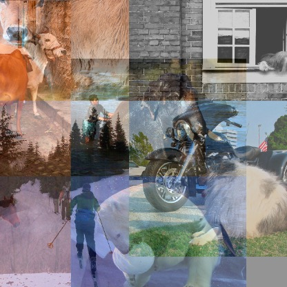

# Class Imbalance in Object Detection and Mitigation Strategies with YOLOv5

Object detection is the task of localizing and classifying objects in an image. Imbalance in object detection datasets could arise from uneven class distributions, uneven distribution in the size of the bounding boxes, or even the location of the bounding boxes in the images. Further, imbalance in class distributions in object detection is classified into two types: foreground-background and foreground-foreground. The latter, foreground-foreground imbalance, is especially critical as it can lead to a skewed detector that favors more commonly occurring objects, potentially at the expense of accurately detecting rarer items. Our technical report delves into three targeted strategies to address these imbalances within the context of the YOLOv5 (small) architecture, a compact yet powerful neural network designed for efficient and effective object detection.

The first strategy, `sampling`, specifically addresses class representation by altering the selection process of training samples to enhance the visibility of less represented classes. However, while beneficial for minority classes, this method may inadvertently suppress the recognition capability for the majority class, thereby affecting the model's overall mean Average Precision (mAP).

The second approach involves `loss reweighing`, a technique that fine-tunes the loss function to account for the frequency of each class. By assigning different weights to the losses incurred by each class, we aim to balance the network's learning focus across all classes, mitigating the dominance of any single class in the learning process.

Lastly, `augmentation`, particularly through methods like mixup and mosaic augmentations, aims to synthetically enrich the dataset with more varied instances, enhancing the model's ability to generalize and thus perform more consistently across different classes and scenarios.


## Installation
```
git clone https://github.com/craston/object_detection_cib.git
cd object_detection_cib

virtualenv .od_env
source .od_env/bin/activate

pip install -r requirements.txt
export PYTHONPATH=$PWD 
```
## Dataset Construction for Long-Tailed Distribution

In sculpting a long-tailed distribution for our study, we curated a subset from the COCO dataset by selecting the 10 most prevalent classes: person, car, dining table, chair, cup, bottle, cat, dog, sink, and truck. To simplify the dataset and minimize complexity, we limited our selection to images featuring fewer than 10 object detections. We allocated the number of images for each class based on a Zipfian distribution, positioning 'person' as the majority class while designating 'truck' as the minority class, to reflect a realistic class frequency scenario.
<table>
<tr>
<td align="center">
<br>
Number of images per class
</td>
<td align="center">
<br>
Number of instances per class
</td>
</tr>
</table>

To create the dataset:
```
python kod/cli/data.py make-coco-zipf
python kod/cli/data.py gen-cache coco-zipf --split=train
python kod/cli/data.py gen-cache coco-zipf --split=validation
```

##  Baseline Model Framework
Our investigation into the effectiveness of different class balancing techniques is anchored on a baseline model comprising the YOLOv5 small (yolov5s) architecture. We initiate training from scratch, incorporating mosaic augmentation to enhance the training dataset. This approach ensures a comprehensive evaluation of class balancing strategies, starting from a well-defined and robust baseline.


To train the model to obtain the baseline results
```
python kod/cli/hydra_train.py experiment=yv5s dataset_name=coco-zipf  logger=csv 
```
GPU Training
```
python kod/cli/hydra_train.py experiment=yv5s dataset_name=coco-zipf  logger=csv  trainer=gpu
```
To evaluate the trained model:
```
python kod/cli/hydra_train.py experiment=yv5s dataset_name=coco-zipf logger=csv train=False test=True ckpt_path=kod/trained_models/yv5s-coco-zipf-mosaic.ckpt
```
| Metric | Nb. of <br>instances |  Yv5s + mosaic <br>(baseline) |
| :--- | ---: | ---: | 
| map  |  | 32.0 |
| map50 |  | 43.8 |
| map50_person  | 12982 |  71.6 |
| map50_car | 6918 |   43.1  |
| map50_dining table  | 2409 |  40.5  |
| map50_chair  | 2663 |  21.6  |
| map50_cup  | 1837 | 29.3  |
| map50_bottle  | 1829   | 24.5 |
| map50_cat | 1096 |  72.8 |
| map50_dog  | 1009 |   58.4  |
| map50_truck | 941 |   34.0 |
| map50_sink | 883 |  41.7 |


## Strategy 1: Sampling
### Class-Aware Sampling
This method was introduced by [Shen et al](https://arxiv.org/pdf/1512.05830.pdf) addresses the issue of imbalance in classification datasets by optimizing the composition of mini-batches. The objective is to populate each mini-batch in a manner that ensures a uniform representation of classes. To achieve this, we maintain two lists:

* A list containing all the class names
* List of images per class

The process for assembling a mini-batch begins with the random selection of a class, denoted as class X, from the list of class names. Subsequently, we randomly choose an image from the list of images that are categorized under class X. To maintain the randomness and diversity of the training batches, a shuffle operation is executed whenever we exhaust the entries in either the class list or the per-class image list. This strategy ensures a balanced and varied exposure to different classes during the training process.

To train the model with class-aware sampler:
```
python kod/cli/hydra_train.py experiment=imbalance/class_aware/default.yaml dataset_name=coco-zipf logger=csv 
```
To evaluate the trained model:
```
python kod/cli/hydra_train.py experiment=yv5s dataset_name=coco-zipf logger=csv train=False test=True ckpt_path=kod/trained_models/yv5s-coco-zipf-mosaic-cas.ckpt
```

| Metric | Nb. of <br>instances | Yv5s + mosaic <br> (baseline) | Yv5s + mosaic <br>+ CAS |
| :- | -: | -: | -: |
| map  |  | 32.0 | 31.4 (-0.6) |
| map50 |  | 43.8 | 43.2 (-0.6) |
| map50_person  | 12982 | 71.6  | 71.1 (-0.5) |
| map50_car | 6918 | 43.1 | 43.1 (0.0) |
| map50_dining table  | 2409 | 40.5 | 39.4 (-1.1) |
| map50_chair  | 2663 | 21.6 | 21.3 (-0.3) |
| map50_cup  | 1837 | 29.3 | 32.5 (+3.2) |
| map50_bottle  | 1829 | 24.5 | 24.8 (+0.3) |
| map50_cat | 1096 | 72.8 | 71.5 (-1.3) |
| map50_dog  | 1009 | 58.4 | 57.4 (-1.0) |
| map50_truck | 941 | 34.0 | 32.8 (-1.2) |
| map50_sink | 883 | 41.7 | 38.6 (-3.1) |


In the figure below, it is evident that the mean Average Precision at IoU 0.5 (mAP50) is higher during the early phases of training when employing class-aware sampling (yv5s-coco-zipf-cas). However, as training progresses, the mAP50 with class-aware sampling becomes lower than the baseline (yv5s-coco-zipf).

<div align="center">
<br>
 Validation mAP50 over Training Progression: A Comparative Analysis of Models Trained With and Without Class-Aware Sampling (CAS)
</div>


> Class-aware sampling seems to help the improve the performance of some tail classes at the expense of the majority class. This leads to a drop in the overall mAP.

### Repeat-Factor Sampling
This strategy described by [Gupta et al](https://arxiv.org/pdf/1908.03195.pdf) involves oversampling the images that contain the tail classes. For each image in the dataset, we need to calculate the number of times the image needs to be repeated. Let’s call this image-level repeat factor, $r_i$ for image $i$.

First, for each class, $c$ let’s define

$$f_c=\dfrac{\text{Number of training images that contain class, }c}{\text{Total number of taining images}}$$

We then define category-level repeat factor,

$$r_c = \text{max} \left(1, \sqrt{\frac{t}{f_c}}\right)$$

where $t$ is a hyper-parameter. The thresholding parameter, t controls the point at which oversampling kicks in.
For categories with fc ≤ t, there is no oversampling.

As each image may contain multiple instances of different classes, we finally define the image-level repeat factor for image $i$ as,

$$r_i = \text{max}_{c\in i}r_c$$ 

where $\lbrace c\in i\rbrace$ are all the categories present in $i$.

In addition, we explore an alternative approach by using the mean of the category-level repeat factors:

$$r_i = \text{mean}_{c\in i}r_c$$

This repeat factor sampling technique is then integrated into our training regimen to effectively handle the issue of class imbalance.
```
# With mean
python kod/cli/hydra_train.py experiment=imbalance/repeat_factor/default.yaml dataset_name=coco-zipf logger=csv

# With max
python kod/cli/hydra_train.py experiment=imbalance/repeat_factor/default.yaml dataset_name=coco-zipf logger=csv data.sampler.reduction=max 
```
To evaluate the trained model:
```
python kod/cli/hydra_train.py experiment=yv5s dataset_name=coco-zipf logger=csv train=False test=True ckpt_path=kod/trained_models/yv5s-coco-zipf-mosaic-rf-mean.ckpt

python kod/cli/hydra_train.py experiment=yv5s dataset_name=coco-zipf logger=csv train=False test=True ckpt_path=kod/trained_models/yv5s-coco-zipf-mosaic-rf-max.ckpt
```
| Metric | Nb. of <br>instances | Yv5s + mosaic <br>(baseline) | Yv5s + mosaic <br>+ RF(max) |  Y5s + mosaic<br />+ RF(mean) |
| :- | -: | -: | -: | -: | 
| map  |  | 32.0 | 30.7 (-1.3) | 31.1 (-0.9) |  
| map50 |  | 43.8 | 42.3 (-1.5) | 42.3 (-1.5) |  
| map50_person  | 12982 | 71.6  | 70.2 (-1.4) | 70.7 (-0.9) | 
| map50_car | 6918 | 43.1 | 40.6 (-2.5) | 43.5 (-0.4) | 
| map50_dining table  | 2409 | 40.5 | 40.6 (+0.1) | 40.5 (0.0) |  
| map50_chair  | 2663 | 21.6 | 23.4 (+1.8) | 19.1 (-2.5) | 
| map50_cup  | 1837 | 29.3 | 33.4 (+4.1) | 30.2 (-0.9) | 
| map50_bottle  | 1829 | 24.5 | 19.9 (-4.6) | 23.8 (-0.7) | 
| map50_cat | 1096 | 72.8 | 67.6 (-5.2) | 68.0 (-4.8) |  
| map50_dog  | 1009 | 58.4 | 55.2 (-3.2) | 56.7 (-1.7) |  
| map50_truck | 941 | 34.0 | 29.5 (-4.5) | 30.1 (-3.9) |  
| map50_sink | 883 | 41.7 | 42.4 (+0.7) | 40.9 (-0.8) |  

In the figure below, similar to class-aware sampling we observe that the mAP50 using repeat factor sampling (yv5s-coco-zipf-rf-sqrt-mean) is higher in the initial stages of the training. But as training progress the mAP50 using repeat factor sampling is lower than the baseline (yv5s-coco-zipf).

<div align="center">
<br>
 Validation mAP50 over Training Progression: A Comparative Analysis of Models Trained With and Without Repeat Factor (RF) Sampling.
</div>

 > Repeat Factor sampling appears to enhance the performance of certain tail classes but comes at the cost of the majority class. Consequently, this trade-off manifests as a decrease in the overall mean Average Precision (mAP).

## Strategy 2: Loss-Reweighing
In the YOLOv5 architecture, classification loss is quantified using binary cross-entropy. To maintain a balanced contribution of losses from different classes, we modulate the positive weights in accordance with the occurrence frequency of each respective class. These weights are derived using the formula:
$$w_c = \dfrac{\text{Total number of instances}}{\text{Total number of instances of class c}}$$
This weighting scheme ensures that the loss contribution is adjusted to reflect the class distribution within the dataset.
To enable loss balancing
```
python kod/cli/hydra_train.py experiment=yv5s dataset_name=coco-zipf logger=csv use_loss_weights=True
```
To evaluate the trained model:
```
python kod/cli/hydra_train.py experiment=yv5s dataset_name=coco-zipf logger=csv train=False test=True ckpt_path=kod/trained_models/yv5s-coco-zipf-mosaic-loss-weights.ckpt
```
| Metric | Nb. of <br>instances | Yv5s + mosaic <br>(Baseline) | Yv5s + mosaic <br>+ Loss_weights |
| :- | -: | -: | -: |
| map  |  | 32.0 | 31.2 (-0.8) |
| map50 |  | 43.8 | 41.9 (-1.9) |
| map50_person  | 12982 | 71.6  | 71.2 (-0.4) |
| map50_car | 6918 | 43.1 | 44.4 (+1.3) |
| map50_dining table  | 2409 | 40.5 | 38.3 (-2.2) |
| map50_chair  | 2663 | 21.6 | 18.8 (-2.8) |
| map50_cup  | 1837 | 29.3 | 30.8 (+1.5) |
| map50_bottle  | 1829 | 24.5 | 24.8 (+0.3) |
| map50_cat | 1096 | 72.8 | 69.0 (-3.8) |
| map50_dog  | 1009 | 58.4 | 51.3 (-7.1) |
| map50_sink | 883 | 41.7 | 39.6 (-2.1) |
| map50_truck | 941 | 34.0 | 30.7 (-3.3) |


The figure below highlights a key challenge in loss reweighing: effectively balancing various loss components, particularly objectness and classification. The data shows a marked discrepancy where the classification loss, when subjected to loss reweighing, is substantially lower than the objectness loss. This contrast is significant when compared to the baseline, where these losses are observed to be relatively comparable.

<table>
<tr>
<td align="center">
<br>
Objectness Loss 
</td>
<td align="center">
<br>
Classification Loss 
</tr>
</table>

## Strategy 3: Augmentation
### Mosaic Augmentation
This method creates a composite image by stitching together four distinct training images, yielding a singular mosaic input. The final composition features segments of each original image, assembled to form a mosaic-like pattern. This technique is instrumental in introducing a rich diversity of context and object scales within a single training instance.

<div align="center">
<br>
Mosaic-augmented input image
</div>

To train model without mosaic augmentation:

```
python kod/cli/hydra_train.py experiment=yv5s_no_mosaic dataset_name=coco-zipf logger=csv 
```
To evaluate the trained model:
```
python kod/cli/hydra_train.py experiment=yv5s dataset_name=coco-zipf logger=csv train=False test=True ckpt_path=kod/trained_models/yv5s-coco-zipf-no-mosaic.ckpt
```
| Metric | Nb. of <br>instances | Yv5s <br> (no-mosaic)  | Yv5s + mosaic <br>(baseline) |
| :- | -: | -: | -: |
| map  |  | 25.4 | 32.0 (+6.6) | 
| map50 |  | 35.8 | 43.8 (+8.0) | 
| map50_person  | 12982 | 65.5 | 71.6 (+6.1) | 
| map50_car | 6918 | 37.0 | 43.1 (+6.1) | 
| map50_dining table  | 2409 | 35.7 | 40.5 (+4.8) |
| map50_chair  | 2663 | 19.2 | 21.6 (+2.4) | 
| map50_cup  | 1837 | 24.0 | 29.3 (+5.3) | 
| map50_bottle  | 1829 | 15.6 | 24.5 (+8.9) |
| map50_cat | 1096 | 57.1 | 72.8 (+15.7) | 
| map50_dog  | 1009 | 45.2 | 58.4 (+13.0) | 
| map50_truck | 941 | 24.4 | 34.0 (+9.6) | 
| map50_sink | 883 | 34.4 | 41.7 (+7.3) |

### Mixup Augmentation
This approach synthesizes novel training instances by performing linear interpolation between pairs of existing data points along with their associated labels. In our specific application, we employ this technique utilizing pairs of images that have already been enhanced through mosaic augmentation to create our mixup augmented samples. Additionally, we have meticulously adjusted the probability of applying the mixup augmentation to optimize its efficacy.
<table>
<tr>
<td align="center">
<br>
Mosaic-augmented input image <br> (A)
</td>
<td align="center">
<br>
Mosaic-augmented input image <br> (B)
</td>
<td align="center">
<br>
Mixup-augmented image: <br> t*A + (1-t)*B
</td>
</tr>
</table>

To train model with mosaic and mixup augmentation:
```
python kod/cli/hydra_train.py experiment=yv5s dataset_name=coco-zipf logger=csv data.mixup_prob=0.3
```
To evaluate the trained model:
```
python kod/cli/hydra_train.py experiment=yv5s dataset_name=coco-zipf logger=csv train=False test=True ckpt_path=kod/trained_models/yv5s-coco-zipf-mosaic-mixup0.3.ckpt
```

| Metric |Nb. of <br>instances | Yv5s+mosaic<br>(baseline) | Yv5s+mosaic+<br>mixup_prob=0.1 | Yv5s+mosaic+<br>mixup_prob=0.2 | Yv5s+mosaic+<br>mixup_prob=0.3 |  
| :- | -: | -: | -: | -: | -: | 
| map  |  | 32.0 | 32.7 (+0.7) | 33.1 (+1.1) | 34.3 (+2.3) | 
| map50 |  | 43.8 | 44.5 (+0.7) | 45.8 (+2.0) | 47.1 (+3.3) | 
| map50_person  | 12982 | 71.6 | 72.5 (+0.9) | 72.3 (+0.7) | 74.1 (+2.5) |  
| map50_car | 6918 | 43.1 | 44.2 (+1.1) | 46.4 (+3.3) | 45.4 (+2.3) | 
| map50_dining table  | 2409 | 40.5 | 40.6 (+0.1) | 42.7 (+2.2) | 40.0 (-0.5) | 
| map50_chair  | 2663 | 21.6 | 22.5 (+0.9) | 22.9 (+1.3) | 21.9 (+0.3) |  
| map50_cup  | 1837 | 29.3 | 33.6 (+4.3) | 33.7 (+4.4) | 36.9 (+7.6) |  
| map50_bottle  | 1829 | 24.5 | 25.5 (+1.5) | 31.7 (+7.2) | 30.1 (+5.6) | 
| map50_cat | 1096 | 72.8 | 71.7 (-1.1) | 73.6 (+0.8) | 76.3 (+3.5) | 
| map50_dog  | 1009 | 58.4 | 58.4 (0.0) | 56.6 (-1.8) | 64.1 (+5.7) |  
| map50_truck | 941 | 34.0 | 34.8 (+0.8) | 35.3 (+1.3) | 37.2 (+3.2) |  
| map50_sink | 883 | 41.7 | 40.8 (-0.9) | 42.5 (+0.8) | 45.4 (+3.7) |  

In the figure below, shows the comparative performance improvement in mean average precision (mAP) over training epochs for two machine learning models: 'yv5s-coco-zipf-mixup0.3' employing mixup data augmentation, and a baseline 'yv5s-coco-zipf', highlighting the enhanced accuracy achieved with mixup over time.

<p align="middle">
 <br>
 Validation mAP50 over Training Progression: A Comparative Analysis of Models Trained With and Without Mixup Augmentation
</p>

> Mixup augmentation significantly enhances overall model performance. Optimal results are achieved by carefully adjusting the probability of applying mixup during the training process.

# Conclusion
In our experimental evaluation of three distinct strategies, it emerged that data augmentation was the most effective in enhancing the mean average precision (mAP) across the board. Specifically, the use of mixup data augmentation proved to significantly boost model performance. On the other hand, while sampling techniques did offer benefits to certain classes, they adversely affected the performance of the predominant class. The application of loss weighing required intricate adjustments to various loss components, such as objectness and classification. Despite our efforts, we did not succeed in achieving an optimal balance that could lead to improvements in the overall mAP.

